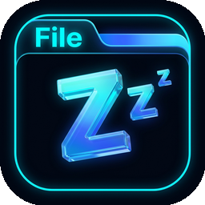
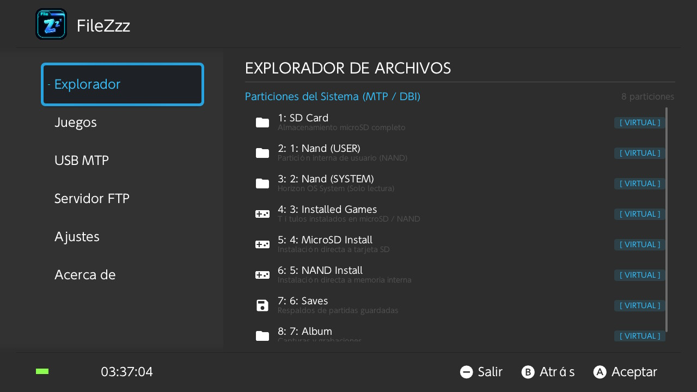
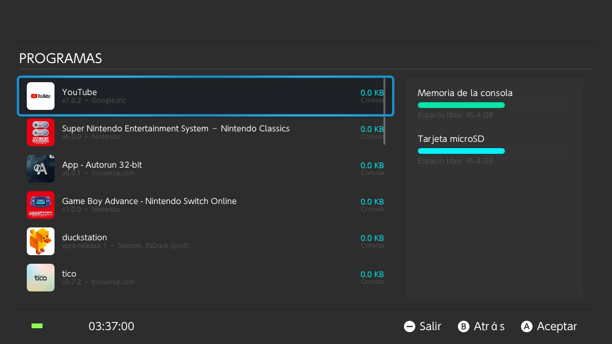
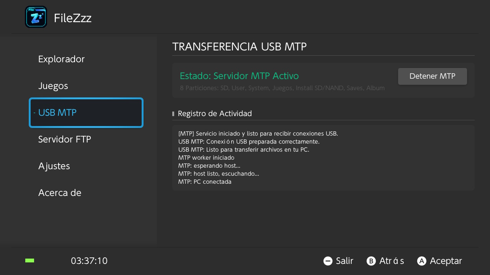
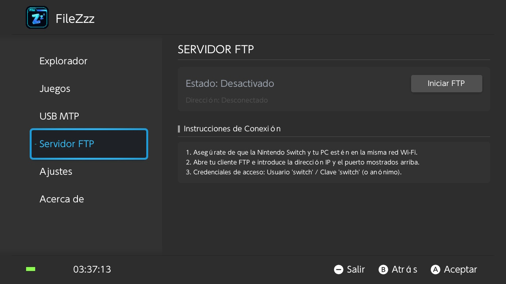
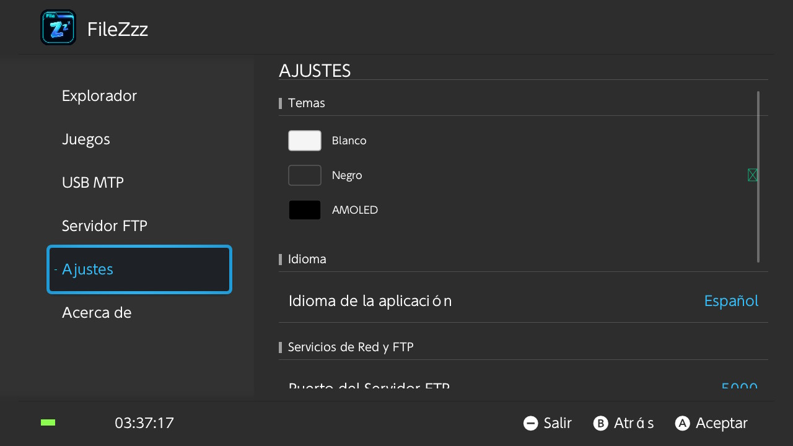
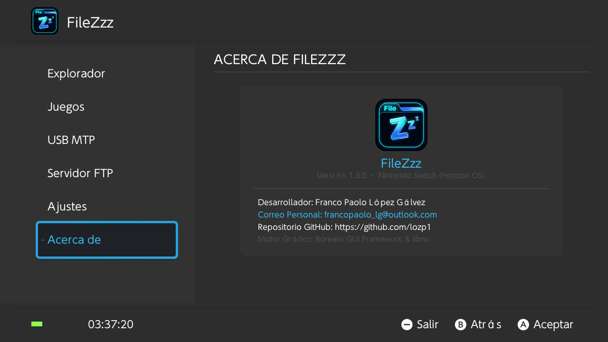

<div align="center">



<h1 align="center">
    
</h1>

<h3 align="center">🎮 Gestor de Archivos, Servidor MTP/FTP y Administrador de Contenido para Nintendo Switch 🇬🇹</h3>

<br/>

[](https://www.nintendo.com/)
[](https://github.com/lozp1/FileZzz/releases)
[](https://github.com/xfangfang/borealis)
[](https://en.cppreference.com/)
[](https://opensource.org/licenses/MIT)

<br/><br/>

<p align="center">
  <b>FileZzz</b> es una suite todo-en-uno de gestión de almacenamiento, exploración y transferencia de datos diseñada exclusivamente para <b>Nintendo Switch (Horizon OS)</b>.
  Ofrece una experiencia moderna, fluida y <b>100% traducida al español y multilenguaje</b>, combinando una interfaz visual intuitiva, personalización avanzada y un rendimiento impecable a <b>60 FPS</b>.
</p>

[✨ Características](#-características-principales) •
[📸 Capturas de Pantalla](#-capturas-de-pantalla) •
[🎮 Controles](#-controles-y-navegación) •
[🛠️ Instalación](#️-guía-de-instalación) •
[📦 Descargas](#-descargas-y-releases) •
[☕ Donaciones](#-donaciones-y-apoyo) •
[👨‍💻 Autor](#-desarrollador--autor)

<hr/>

</div>

## 🌟 Características Principales

- 📂 **Explorador de Archivos y Particiones del Sistema:** Acceso directo a la microSD física (`sdmc:/`) y montaje dinámico de las particiones virtuales de la consola:
  - `1: SD Card` (Almacenamiento microSD completo con lectura y escritura a alta velocidad).
  - `2: 1: Nand (USER)` (Partición interna de usuario en modo exploración).
  - `3: 2: Nand (SYSTEM)` (Archivos esenciales de Horizon OS en modo solo lectura).
  - `4: 3: Installed Games` (Visor de títulos instalados en microSD y memoria del sistema).
  - `5: 4: MicroSD Install` *(En desarrollo / Staging)* (Recepción de paquetes para el motor de instalación NCM/ES).
  - `6: 5: NAND Install` *(En desarrollo / Staging)* (Recepción de paquetes hacia la memoria interna).
  - `7: 6: Saves` *(En desarrollo)* (Estructura base para la futura gestión y respaldo de partidas).
  - `8: 7: Album` (Acceso directo a capturas de pantalla y grabaciones de video).

> ℹ️ **Nota de transparencia sobre la versión Alpha actual (v1.3.0):**
> Las funciones de exploración de archivos, servidor FTP, transferencia MTP de la MicroSD física/Álbum, personalización de temas y visor de programas instalados están **100% operativas**. La instalación directa al menú de inicio de la consola (`.nsp`/`.nsz`) y la extracción de partidas guardadas se encuentran en desarrollo activo para la versión v1.4.0.
- 🎮 **Gestor de Programas y Juegos Instalados (60 FPS):** Carga instantánea y desacoplada de títulos instalados, iconos en alta definición, versiones, autores, cálculo de tamaño exacto y barras de capacidad en tiempo real para memoria interna y microSD.
- ⚡ **Servidor USB MTP de Alta Velocidad:** Conecta tu Nintendo Switch al PC (Windows, macOS o Linux) sin necesidad de controladores adicionales. Transfiere archivos a máxima velocidad con bitácora de actividad en vivo.
- 📶 **Servidor FTP Inalámbrico:** Conexión local Wi-Fi segura o anónima para gestionar todo el contenido de la tarjeta SD desde FileZilla, WinSCP o navegadores web.
- 🎨 **Selector de Temas con Previsualización:** Diseñado con el lenguaje visual de Horizon OS. Incluye selector interactivo con tarjetas de previsualización física:
  - ⚪ **Blanco (Claro)**
  - ⚫ **Negro (Oscuro)**
  - 🌑 **AMOLED (Negro puro para pantallas OLED)**
- 🌍 **Soporte Multilenguaje Real:** Menú contextual desplazable con selección inmediata y marca de verificación para *Español, English, Français, Deutsch, Italiano, Nederlands, Português, Русский, 日本語, 简体中文, 繁體中文 y 한국어*.
- 📋 **Menú Contextual de Operaciones:** Copiar, cortar, renombrar, eliminar recursivamente y ver propiedades técnicas avanzadas en fichas detalladas.
- 🛑 **Cierre Limpio y Seguro:** Cierre rápido mediante el botón <kbd>-</kbd> (Minus) con diálogo de confirmación que previene corrupciones de datos.

<hr/>

## 📸 Capturas de Pantalla

<div align="center">

### 1. Explorador de Archivos y Particiones Virtuales
Exploración nativa de la tarjeta microSD y acceso directo a las 8 particiones virtuales del sistema.



<br/><br/>

### 2. Gestor de Programas y Juegos Instalados
Visualización de títulos con iconos oficiales, versiones, tamaño en cian brillante e indicadores de almacenamiento en vivo para NAND y microSD.



<br/><br/>

### 3. Servidor de Transferencia USB MTP
Conexión directa por cable USB tipo C para montar particiones en tu PC con telemetría y registro de conexión en tiempo real.



<br/><br/>

### 4. Servidor FTP Inalámbrico
Transferencia inalámbrica de archivos por red Wi-Fi local sin requerir cables ni retirar la tarjeta SD.



<br/><br/>

### 5. Ajustes del Sistema, Temas Dinámicos e Idiomas
Tarjetas de previsualización de temas (Blanco, Negro, AMOLED) y selector de idiomas internacional con indicador nativo.



<br/><br/>

### 6. Acerca de FileZzz (Versión 1.3.0)
Ficha técnica del proyecto, créditos de desarrollo y motor gráfico.



</div>

<hr/>

## 🎮 Controles y Navegación

| Botón | Acción | Contexto |
| :---: | :--- | :--- |
| <kbd>D-Pad</kbd> / <kbd>Stick L</kbd> | Navegación entre pestañas, archivos y elementos | Global |
| <kbd>A</kbd> | Abrir carpeta / Confirmar acción / Entrar a sub-formulario | Listas y diálogos |
| <kbd>B</kbd> | Regresar a la pantalla anterior / Cancelar diálogo | Global |
| <kbd>X</kbd> | Abrir menú contextual de archivo (Copiar, Cortar, Eliminar, Propiedades) | Explorador |
| <kbd>Y</kbd> | Acciones de portapapeles y crear directorio | Explorador |
| <kbd>-</kbd> | Salir de la aplicación con confirmación segura | Global |
| <kbd>+</kbd> | Menú de opciones rápidas | Global |

<hr/>

## 🛠️ Guía de Instalación

### Requisitos Previos:
- Una consola **Nintendo Switch** con Custom Firmware (Atmosphère recomendado).
- Tarjeta microSD formateada en **FAT32** (o exFAT con drivers compatibles).

### Pasos de Instalación:
1. Dirígete a la sección de **[Releases](https://github.com/lozp1/FileZzz/releases)** y descarga la última versión de `FileZzz.nro`.
2. Conecta la tarjeta microSD a tu computadora o utiliza conexión MTP/FTP.
3. Copia el archivo `FileZzz.nro` dentro del directorio:
   ```text
   sdmc:/switch/FileZzz.nro
   ```
   *(o alternativamente en `sdmc:/switch/FileZzz/FileZzz.nro`)*.
4. Inserta la microSD en tu Nintendo Switch e inicia tu Custom Firmware.
5. Abre el **Homebrew Menu** manteniendo presionado el botón <kbd>R</kbd> mientras abres cualquier juego instalado (modo de memoria completa / High Memory Mode).
6. Localiza **FileZzz** en la lista y presiona <kbd>A</kbd> para iniciarlo.

<hr/>

## 📦 Descargas y Releases

La versión oficial compilada y lista para utilizar está disponible de forma gratuita:

👉 **[Descargar la última versión de FileZzz (GitHub Releases)](https://github.com/lozp1/FileZzz/releases/latest)**

<hr/>

## ☕ Donaciones y Apoyo

**FileZzz** es un proyecto desarrollado de forma abierta e independiente para la comunidad de Nintendo Switch.

Si esta herramienta te es útil y deseas apoyar su mantenimiento y desarrollo continuo de nuevas funciones:

- ⭐ **Dale una Estrella al Repositorio en GitHub:** Nos ayuda a llegar a más usuarios.
- 💖 **GitHub Sponsors:** [github.com/sponsors/lozp1](https://github.com/sponsors/lozp1)
- 💳 **PayPal:** [paypal.me/francopaololg](https://paypal.me/francopaololg)
- 📧 **Contacto Directo:** [francopaolo_lg@outlook.com](mailto:francopaolo_lg@outlook.com)

<hr/>

<div align="center">

## 👨‍💻 Desarrollador / Autor

<b>Franco Paolo López Gálvez</b><br/>
*Software Engineer — Guatemala 🇬🇹*

<br/>

<a href="mailto:francopaolo_lg@outlook.com">
  
</a>
<a href="https://linkedin.com/in/franco-lopez" target="_blank">
  
</a>
<a href="https://github.com/lozp1" target="_blank">
  
</a>

<br/><br/>

### 📄 Licencia
Este proyecto está distribuido bajo la Licencia **MIT**. Consulta el archivo [LICENSE](LICENSE) para más detalles.<br/>
FileZzz © 2026. Todos los derechos reservados.

</div>
